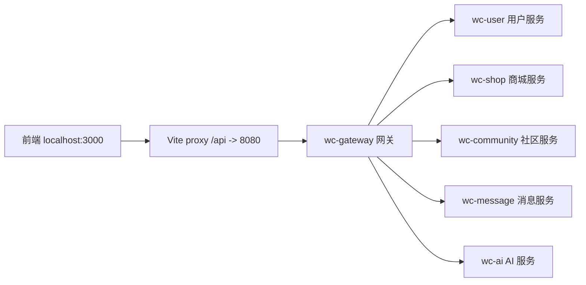
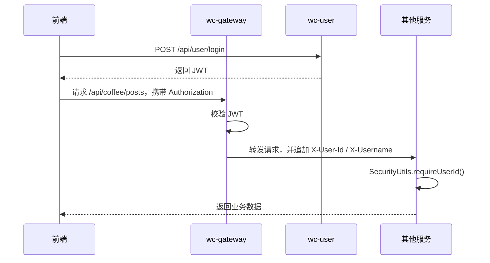
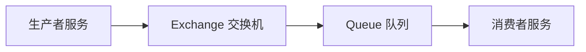
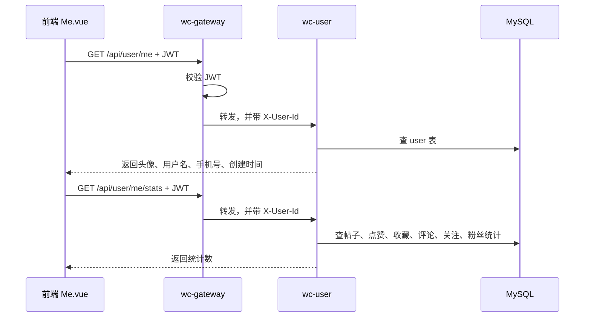
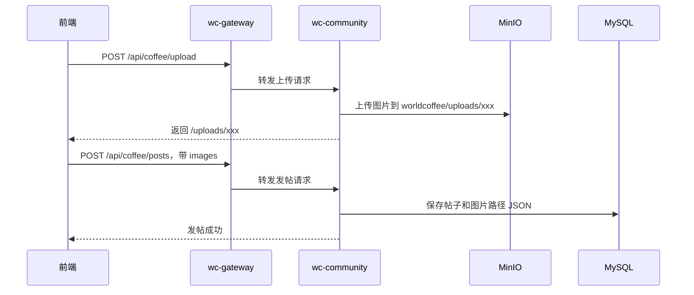
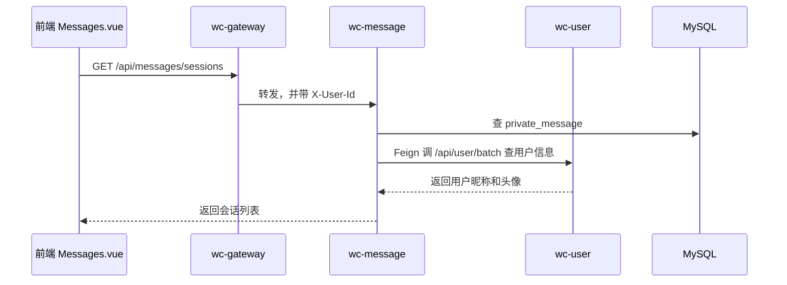
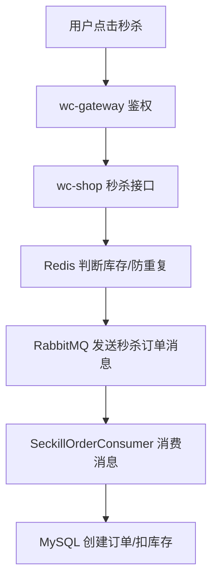

# WorldCoffee 微服务学习地图

这份文档不是为了证明“项目很高级”，而是为了帮你把这个项目重新看懂。

你现在晕，是因为项目已经从单体拆成了多个服务，但脑子里还没有形成一张地图。微服务最难的不是写 Controller，而是知道：

- 一个请求从前端进来以后去了哪里
- 哪些服务负责哪些业务
- 服务之间怎么互相调用
- 登录态怎么传递
- 图片、缓存、消息、搜索这些基础设施各自干什么
- 为什么不能所有东西都塞进一个 Spring Boot 项目里

这份文档会按“先看全局，再看局部”的方式讲。

## 1. 这个项目现在长什么样

当前后端是一个 Maven 多模块工程：

```text
microservices
├─ pom.xml                父工程，统一版本和模块聚合
├─ wc-common              公共模块
├─ wc-gateway             网关服务，前端请求入口
├─ wc-user                用户服务
├─ wc-shop                商城服务
├─ wc-community           社区服务
├─ wc-message             消息服务
└─ wc-ai                  AI 服务
```

父工程 `pom.xml` 只负责“组织项目”和“统一依赖版本”。它本身不是一个业务服务。

真正能启动的是这些模块里的 Application：

| 服务 | 端口 | 启动类 | 主要职责 |
|---|---:|---|---|
| `wc-gateway` | 8080 | `GatewayApplication` | 所有前端 API 的入口，路由转发，JWT 鉴权 |
| `wc-shop` | 8081 | `ShopApplication` | 商品、购物车、订单、优惠券、秒杀、支付 |
| `wc-user` | 8082 | `UserApplication` | 注册、登录、用户资料、头像、关注统计 |
| `wc-community` | 8083 | `CommunityApplication` | 帖子、评论、点赞、收藏、举报、社区图片上传 |
| `wc-message` | 8084 | `MessageApplication` | 私信、通知、SSE、未读数 |
| `wc-ai` | 8085 | `AiApplication` | AI 对话、知识库上传 |

前端开发环境访问的是：

```text
http://localhost:3000
```

但前端不会直接访问 `8081`、`8082`、`8083`。它会请求：

```text
http://localhost:3000/api/...
```

Vite 会把 `/api` 代理到网关：

```text
http://localhost:8080
```

然后由网关决定转给哪个微服务。

## 2. 一句话理解每个服务

可以把整个系统想成一家公司：

| 模块 | 像公司里的谁 | 它管什么 |
|---|---|---|
| `wc-gateway` | 前台/保安 | 接待所有请求，检查 token，把请求送到正确部门 |
| `wc-user` | 用户中心 | 账号、登录、个人资料、头像、关注关系 |
| `wc-shop` | 商城部门 | 商品、订单、购物车、库存、优惠券、支付 |
| `wc-community` | 社区部门 | 发帖、评论、点赞、收藏、举报 |
| `wc-message` | 消息中心 | 私信、通知、未读数、SSE 推送 |
| `wc-ai` | AI 助手部门 | AI 聊天、知识库 |
| `wc-common` | 公共工具包 | 返回格式、异常、JWT、安全工具、RabbitMQ 配置、MinIO 上传 |

`wc-common` 特别注意：它不是服务，不单独启动。它是其他服务共同依赖的一包代码。

## 3. 请求是怎么走的

以前单体项目大概是：

```text
前端 -> Spring Boot 单体 -> Controller -> Service -> Dao -> MySQL
```

现在变成：



也就是说，前端只认网关，网关再把请求分发到具体服务。

### 网关路由表

网关配置在：

```text
wc-gateway/src/main/resources/application.yml
```

当前路由大概是：

| 请求路径 | 转发到 |
|---|---|
| `/api/user/**`, `/api/users/**` | `wc-user` |
| `/api/admin/users/**` | `wc-user` |
| `/api/shop/**` | `wc-shop` |
| `/api/admin/**` | `wc-shop` |
| `/api/coffee/**` | `wc-community` |
| `/api/messages/**` | `wc-message` |
| `/api/notifications/**` | `wc-message` |
| `/api/ai/**` | `wc-ai` |
| `/uploads/**` | `wc-user`，再跳到 MinIO |

这里的 `lb://wc-user`、`lb://wc-shop` 不是 URL，而是服务名。`lb` 是 load balance，表示通过 Nacos 找服务实例。

## 4. Nacos 是干什么的

Nacos 是服务注册中心。

每个服务启动后会告诉 Nacos：

```text
我是 wc-user，我在 8082
我是 wc-shop，我在 8081
我是 wc-community，我在 8083
```

网关收到请求时，不需要写死 `http://localhost:8082`，它只要说：

```text
我要找 wc-user
```

Nacos 就会告诉它实际地址。

所以 Nacos 的作用是：

```text
服务名 -> 服务地址
```

这就是为什么每个服务配置里都有：

```yaml
spring:
  application:
    name: wc-user
  cloud:
    nacos:
      discovery:
        server-addr: 127.0.0.1:8848
```

`spring.application.name` 很重要，它就是注册到 Nacos 里的服务名。

## 5. 登录态是怎么传的

登录发生在 `wc-user`：

```text
POST /api/user/login
```

成功后，`wc-user` 生成 JWT token 返回前端。

前端之后每次请求都带：

```http
Authorization: Bearer xxx
```

网关 `JwtAuthFilter` 会做三件事：

1. 检查白名单，比如登录、注册、部分商品列表
2. 校验 JWT 是否有效
3. 把用户信息塞进请求头，转发给下游服务

下游服务拿到的不是 token，而是网关注入的头：

```http
X-User-Id: 1
X-Username: lx
```

下游服务通过 `SecurityUtils` 读取：

```java
Long userId = SecurityUtils.requireUserId();
```

这就是微服务里的登录链路：



## 6. wc-common 为什么存在

`wc-common` 是公共模块，它解决的是“不要每个服务重复写一遍”。

里面目前有这些东西：

| 内容 | 作用 |
|---|---|
| `Result<T>` | 统一返回格式 |
| `ServiceException` | 统一业务异常 |
| `GlobalExceptionHandler` | 把异常转成统一 JSON |
| `JwtUtil` | JWT 生成和解析 |
| `SecurityUtils` | 从请求头读取当前用户 |
| `RabbitConfig` | RabbitMQ 交换机、队列、路由键 |
| `FileStorageService` | MinIO 文件上传 |
| `UploadResourceController` | `/uploads/**` 跳转 MinIO |
| `RateLimitInterceptor` | 接口限流 |
| `WebMvcConfig` | CORS、拦截器 |

注意：公共模块里放的是“基础能力”，不是业务。

不应该把商品、帖子、订单这种业务逻辑放进 `wc-common`。

## 7. 数据库怎么拆

你现在的项目在配置上仍然大多连接同一个 MySQL 库：

```text
worldCoffee
```

这叫“代码微服务化，数据库还未完全拆库”。

严格微服务里，每个服务最好有自己的数据库：

```text
wc-user      -> user_db
wc-shop      -> shop_db
wc-community -> community_db
wc-message   -> message_db
```

但学习项目里经常先共用一个库，这样开发成本低。

你要理解的是：服务拆分的边界已经出现了，只是数据库还没有物理拆开。

当前大致是：

| 服务 | 主要表 |
|---|---|
| `wc-user` | `user`、用户关注、用户维度的帖子/点赞/收藏统计查询 |
| `wc-shop` | 商品、分类、购物车、订单、支付、优惠券、地址、秒杀 |
| `wc-community` | 帖子、评论、点赞、收藏、举报、关注 |
| `wc-message` | 私信、通知 |
| `wc-ai` | AI 会话 |

这里有一个需要慢慢优化的地方：`wc-user` 和 `wc-community` 都有一些社区相关表的 DAO/domain，这是从单体拆出来时常见的“边界还不够干净”的状态。

不要被它吓到。真实项目拆服务也是逐步清理边界，不是一刀完美。

## 8. 服务之间怎么调用

服务之间主要有两种方式：

1. 同步调用：OpenFeign
2. 异步消息：RabbitMQ

### 8.1 同步调用：Feign

Feign 就是“像调用 Java 接口一样调用另一个 HTTP 服务”。

例如 `wc-message` 要显示私信会话列表，需要知道对方用户的名字和头像。

但用户信息归 `wc-user` 管，所以 `wc-message` 不应该自己查 user 表，而是调用 `wc-user`：

```text
wc-message -> wc-user /api/user/batch
```

代码位置：

```text
wc-message/src/main/java/.../feign/UserFeignClient.java
```

大概意思是：

```java
@FeignClient(name = "wc-user", path = "/api/user")
public interface UserFeignClient {
    @GetMapping("/batch")
    Result<Map<Long, UserInfo>> fetchUsers(@RequestParam("ids") List<Long> ids);
}
```

调用链是：

```text
前端 /api/messages/sessions
-> 网关
-> wc-message
-> wc-message 查询 private_message
-> wc-message 通过 Feign 调 wc-user 查用户头像/昵称
-> 返回会话列表
```

### 8.2 异步消息：RabbitMQ

RabbitMQ 适合“不需要马上等结果”的事情。

比如：

- 点赞后发通知
- 私信后推送消息
- 秒杀下单削峰
- 订单超时取消

RabbitMQ 的关系像这样：



项目里的 RabbitMQ 配置在：

```text
wc-common/src/main/java/cn/lx/worldcoffee/common/config/RabbitConfig.java
```

当前定义了这些：

| 场景 | Exchange | Queue | 用途 |
|---|---|---|---|
| 通知 | `notification.exchange` | `notification.queue` | 点赞、评论等通知 |
| 私信 | `chat.exchange` | `chat.queue.default` | 聊天消息 |
| 秒杀订单 | `seckill.order.exchange` | `seckill.order.queue` | 秒杀订单异步处理 |
| 秒杀死信 | `seckill.order.dead.exchange` | `seckill.order.dead.queue` | 秒杀失败兜底 |
| 订单超时 | `order.timeout.exchange` | `order.timeout.delay.queue` / `order.timeout.queue` | 订单超时取消 |

例如 `wc-shop` 秒杀下单时，不一定马上创建完整订单，而是把消息丢进队列：

```text
wc-shop -> RabbitMQ -> wc-shop 消费者慢慢处理
```

这叫削峰。流量很大时，队列可以缓冲。

## 9. MinIO 在项目里负责什么

MinIO 是文件存储服务。

它负责保存：

- 用户头像
- 社区帖子图片
- 商品图片
- 以后可能还有 AI 文件、附件等

以前单体可能这么存：

```text
项目目录/uploads/xxx.png
```

现在改成：

```text
MinIO bucket: worldcoffee
object: uploads/xxx.png
```

数据库里只保存路径：

```text
/uploads/xxx.png
```

前端展示时：

```text
前端请求 /uploads/xxx.png
-> 网关转到 wc-user
-> UploadResourceController 302 跳转到 MinIO
-> 浏览器加载 http://localhost:9000/worldcoffee/uploads/xxx.png
```

为什么不用静态目录？

因为微服务里本地静态目录会有这些问题：

- 多个服务实例时，A 机器上传的图，B 机器没有
- Docker 容器重建后文件容易丢
- 发布后端代码时不应该带一堆图片
- 图片访问流量会压业务服务
- 后面迁到 OSS/COS/S3 不方便

MinIO 就是“自己部署的 OSS”。

## 10. Redis 在项目里负责什么

Redis 主要做快的、临时的东西。

当前项目里常见用途：

| 用途 | 例子 |
|---|---|
| token 黑名单 | 退出登录后，把 token 加入黑名单 |
| 用户缓存 | `user:info{id}` |
| 短信验证码 | `sms:code:{phone}` |
| 限流 | Lua 脚本统计请求次数 |
| 库存缓存 | 秒杀/商品库存 |

Redis 不适合保存最终业务数据。最终数据还是要落 MySQL。

## 11. Elasticsearch 在项目里负责什么

`wc-shop` 里有 `EsProduct` 和 `EsProductRepository`。

Elasticsearch 用于商品搜索。

MySQL 适合事务和结构化数据，Elasticsearch 适合搜索：

```text
用户输入关键词
-> 查 Elasticsearch
-> 返回匹配商品
```

当前日志里如果出现：

```text
es数据导入失败：null
```

不一定会导致服务启动失败。真正导致服务失败的通常是端口占用、数据库连不上、Redis/RabbitMQ 连不上等。

## 12. 每个服务细讲

### 12.1 wc-gateway

职责：

- 所有 `/api/**` 的入口
- 根据路径转发请求
- JWT 鉴权
- 把用户信息写入请求头

关键文件：

```text
wc-gateway/src/main/resources/application.yml
wc-gateway/src/main/java/cn/lx/worldcoffee/gateway/filter/JwtAuthFilter.java
```

你看网关时，重点看两件事：

1. 路径转发到哪个服务
2. 哪些路径在白名单，不需要登录

### 12.2 wc-user

职责：

- 注册
- 登录
- 当前用户信息
- 用户资料修改
- 头像上传
- 手机号绑定
- 用户统计
- 批量查询用户信息，给其他服务用

常见接口：

| 接口 | 作用 |
|---|---|
| `POST /api/user/register` | 注册 |
| `POST /api/user/login` | 登录 |
| `GET /api/user/me` | 当前用户信息 |
| `PUT /api/user/profile` | 修改资料 |
| `POST /api/user/avatar` | 上传头像 |
| `GET /api/user/me/stats` | 我的统计 |
| `GET /api/user/batch` | 批量查用户，给消息/社区服务用 |

重点理解：

`wc-user` 是身份中心。其他服务不要自己判断用户名、头像，应该通过用户服务拿。

### 12.3 wc-community

职责：

- 帖子列表
- 帖子详情
- 发帖
- 更新/删除帖子
- 评论
- 点赞
- 收藏
- 举报
- 社区图片上传

常见接口前缀：

```text
/api/coffee/**
```

重点理解：

社区服务负责“用户产生的内容”，也就是 UGC。

帖子图片上传后会进入 MinIO，帖子表里只保存图片 URL 列表。

### 12.4 wc-shop

职责：

- 商品
- 分类
- 购物车
- 订单
- 地址
- 优惠券
- 秒杀
- 支付
- 物流
- 管理端商品/订单/优惠券

常见接口前缀：

```text
/api/shop/**
/api/admin/**
```

重点理解：

商城服务是事务最重的服务。订单、库存、支付这些东西都更需要一致性。

秒杀相关逻辑会用 Redis 和 RabbitMQ，因为高并发时不能所有请求都直接打 MySQL。

### 12.5 wc-message

职责：

- 私信
- 会话列表
- 聊天记录
- 标记已读
- 通知列表
- SSE 实时推送

常见接口：

| 接口 | 作用 |
|---|---|
| `GET /api/messages/sessions` | 会话列表 |
| `GET /api/messages/chat/{userId}` | 和某人的聊天记录 |
| `POST /api/messages` | 发送私信 |
| `GET /api/messages/unread-count` | 私信未读数 |
| `GET /api/notifications` | 通知列表 |
| `GET /api/notifications/subscribe` | SSE 订阅 |

重点理解：

消息服务经常需要用户头像和昵称，但这些信息属于 `wc-user`。

所以 `wc-message` 会通过 Feign 调 `wc-user` 的 `/batch` 接口。

### 12.6 wc-ai

职责：

- AI 聊天
- 会话保存
- 知识库文本上传

常见接口前缀：

```text
/api/ai/**
```

重点理解：

AI 服务是一个独立业务能力。它依赖用户登录态，但不应该和商城/社区耦合。

### 12.7 wc-common

职责：

- 公共 Result
- 公共异常
- 安全工具
- MinIO 上传
- RabbitMQ 队列声明
- 全局异常处理
- 跨域和限流

重点理解：

`wc-common` 是“被依赖的 jar 包”，不是服务。

## 13. 一个完整例子：登录后打开我的页面

页面：

```text
frontend/src/views/Me.vue
```

调用：

```text
GET /api/user/me
GET /api/user/me/stats
```

链路：



如果页面和数据库不一致，优先检查：

1. 前端是不是调用了真实接口，还是用了本地假数据
2. 请求有没有带 token
3. token 里是不是当前用户 ID
4. 后端是不是查了正确的表
5. Redis 缓存有没有旧数据

## 14. 一个完整例子：发帖上传图片

链路：



重点：

图片文件在 MinIO，数据库里只保存路径。

## 15. 一个完整例子：私信会话列表

链路：



这个例子能很好理解“服务间调用”：

- 私信数据归 `wc-message`
- 用户头像归 `wc-user`
- 所以 `wc-message` 要问 `wc-user`

## 16. 一个完整例子：秒杀下单

秒杀不能简单地每个请求都直接写 MySQL，因为瞬间请求太多。

大致思路：



这里 Redis 是第一道高速关卡，RabbitMQ 是缓冲层，MySQL 是最终落库。

## 17. 你应该怎么学这个项目

不要从所有代码一起看，会炸。

按这个顺序学：

1. 先看网关

   看懂 `wc-gateway/application.yml` 的路由表。

2. 再看登录

   从 `POST /api/user/login` 到 `JwtAuthFilter` 到 `SecurityUtils.requireUserId()`。

3. 再看一个简单业务

   比如 `GET /api/user/me`，只涉及 user 服务和数据库。

4. 再看一个跨服务业务

   比如 `/api/messages/sessions`，它会从 `wc-message` 调 `wc-user`。

5. 再看一个异步业务

   比如秒杀或通知，理解 RabbitMQ。

6. 最后看基础设施

   Redis、MinIO、Elasticsearch、Nacos、RabbitMQ。

你不需要一天内全懂。你需要的是每次调 bug 时，知道自己处在地图上的哪一层。

## 18. 看代码时的口诀

遇到一个接口，按这个顺序找：

```text
前端 API 调用
-> 网关路由
-> Controller
-> Service
-> Dao
-> 数据库/Redis/MinIO/RabbitMQ/Feign
```

例如：

```text
前端 /api/messages/sessions
-> gateway: /api/messages/** -> wc-message
-> MessageController.listSessions()
-> MessageService.listSessions()
-> messageDao.selectList()
-> userFeignClient.batchGetUsers()
-> wc-user /api/user/batch
```

这条线走通，你就不是在乱看代码了。

## 19. 常见问题对照表

| 现象 | 优先怀疑 |
|---|---|
| 前端 401 | token 没带、token 过期、网关白名单没配 |
| 前端 404 | 网关路由没配、Controller 路径不一致 |
| 前端 500 | 服务内部异常，看对应服务控制台 `Caused by` |
| 图片 302 后红色 | MinIO 没开、桶没 public、旧图片没迁移 |
| 页面和数据库不一致 | 前端假数据、本地缓存、token 用户不对、后端查错表 |
| 服务启动失败端口占用 | 旧进程没停 |
| Feign 调用失败 | Nacos 没注册、返回类型不匹配、目标服务没启动 |
| RabbitMQ 报错 | RabbitMQ 没启动、队列声明冲突 |
| ES 导入失败 | Elasticsearch 没启动或数据格式问题 |

## 20. 你该保留的单体项目理解

微服务不是把单体知识推翻。

单体里的这些知识仍然有用：

- Controller 接收请求
- Service 写业务
- Dao 查数据库
- DTO/Form/VO 分层
- 事务
- 异常处理
- 参数校验

微服务只是多了几层：

- 网关
- 服务注册发现
- 服务间调用
- 分布式登录态
- 消息队列
- 独立文件存储
- 多服务部署

所以你不是“没学”，你是在从单体升级到分布式视角。

## 21. 建议你亲手画一遍

建议拿纸或者 Excalidraw，自己画这四条线：

1. 登录线
2. 我的页面线
3. 发帖上传图片线
4. 私信会话线

每条线都按：

```text
前端 -> 网关 -> 服务 -> 数据库/其他服务/中间件
```

画完以后，这个项目会清楚很多。

## 22. 当前项目的学习重点清单

你现在最该优先搞懂的是：

- `wc-gateway` 怎么按路径转发
- `JwtAuthFilter` 怎么把 token 变成 `X-User-Id`
- `SecurityUtils` 怎么让下游服务拿到当前用户
- `wc-user` 为什么是用户中心
- `wc-message` 为什么要通过 Feign 查用户信息
- `wc-community` 为什么只保存图片路径，不保存图片文件
- MinIO 为什么替代本地 `uploads`
- RabbitMQ 为什么用于通知、私信、秒杀、订单超时
- Redis 为什么用于缓存、验证码、限流、库存

这些通了，项目就不再是一堆散开的模块，而是一张网。

